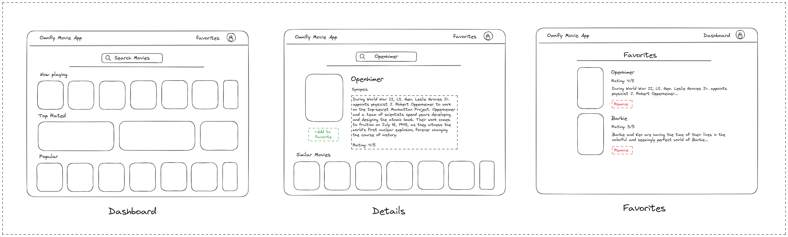
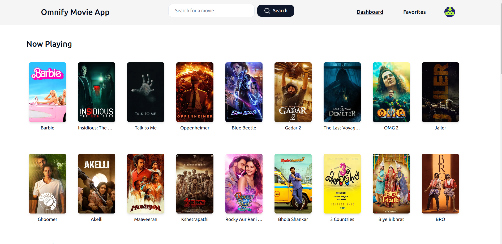
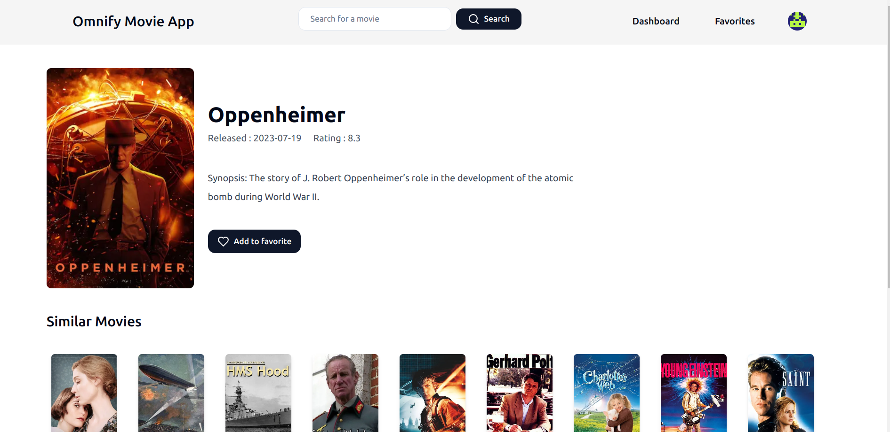
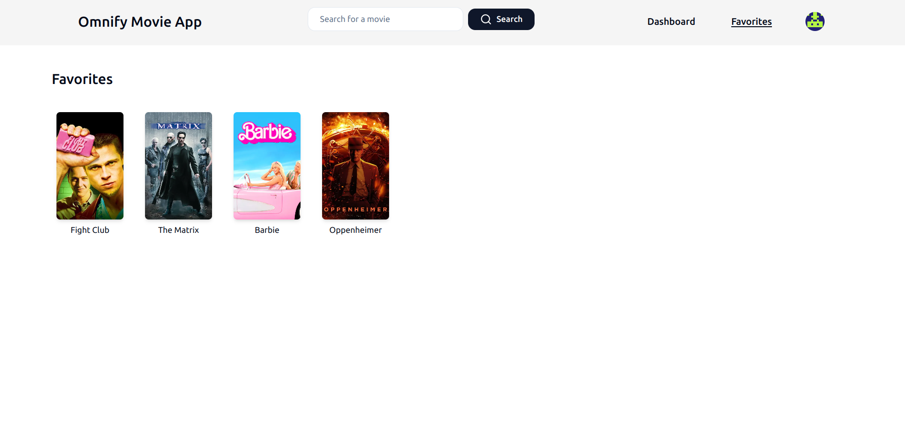
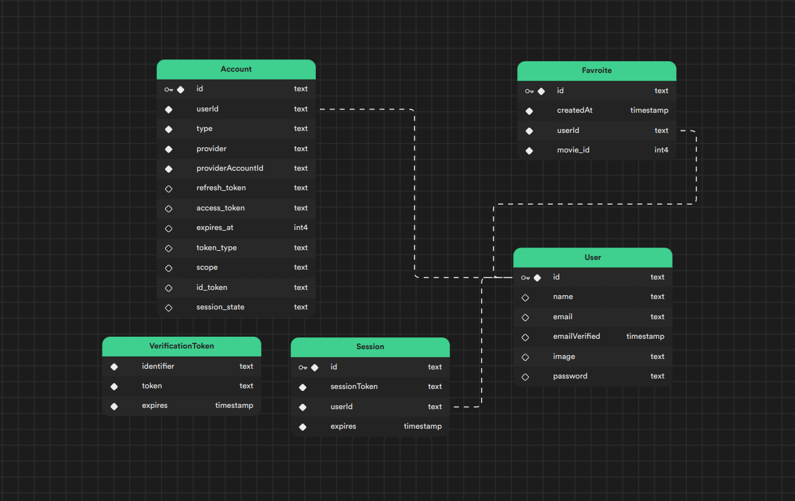
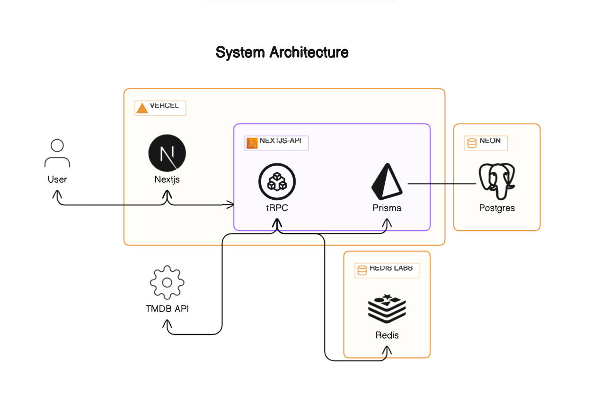

# omnify-movie-app

Demo: [https://omnify.vishalx360.dev/](https://omnify.vishalx360.dev)

Solution for [Full Stack Developer Assignment
](https://docs.google.com/document/d/1A_m4Z_vDmaaHhSdradzjnJhNAqrGzl0NTgvXWMil79k/edit) at [omnify](https://www.getomnify.com/)

A web application that allows users to search for and view information about movies.

## Getting Started

Want to setup locally ? follow [Setup Instructions](/Setup-Instruction.md)

## UI Wireframe

## Final Ui Screenshots

|      Dashboard       | Movie Detail Page  |    Favorite Page    |
| :------------------: | :----------------: | :-----------------: |
|  |  |  |

## Tech Stack

| Technology                                                                             | Description                                                                                                                                 |
| -------------------------------------------------------------------------------------- | ------------------------------------------------------------------------------------------------------------------------------------------- |
| [Next.js](https://nextjs.org)                                                          | A React framework for building web applications.                                                                                            |
| [tRPC](https://trpc.io/)                                                               | A fast TypeScript RPC framework for building APIs.                                                                                          |
| [Neon DB](https://neon.tech/)                                                          | A serverless Postgres database for storing and retrieving data.                                                                             |
| [Prisma](https://www.prisma.io)                                                        | A type-safe ORM for TypeScript and Node.js.                                                                                                 |
| [Nextauth](https://next-auth.js.org)                                                   | An open source authentication solution for Next.js applications.                                                                            |
| [Tailwindcss](https://tailwindcss.com/)                                                | A utility-first CSS framework for building custom designs.                                                                                  |
| [shadnUi](https://ui.shadcn.com/)                                                      | A collection of complex UI components for web applications.                                                                                 |
| [Vercel](https://vercel.com)                                                           | A cloud platform for deploying and managing web applications.                                                                               |
| [Redis](https://redis.com)                                                             | A fast, open source, in-memory, key-value data store.                                                                                       |
| [TMDb API](https://www.themoviedb.org)                                                 | A popular, user editable database for movies and TV shows.                                                                                  |
| [Jest](https://jestjs.io/)                                                             | A delightful JavaScript **Testing** Framework with a focus on simplicity.                                                                   |
| [React Testing Library](https://testing-library.com/docs/react-testing-library/intro/) | A very light-weight solution for testing React components                                                                                   |
| [Github Actions](https://github.com/features/actions)                                  | A continuous integration and continuous delivery **(CI/CD)** platform that allows you to automate your build, test, and deployment pipeline |

## Database Schema

## System Arch

